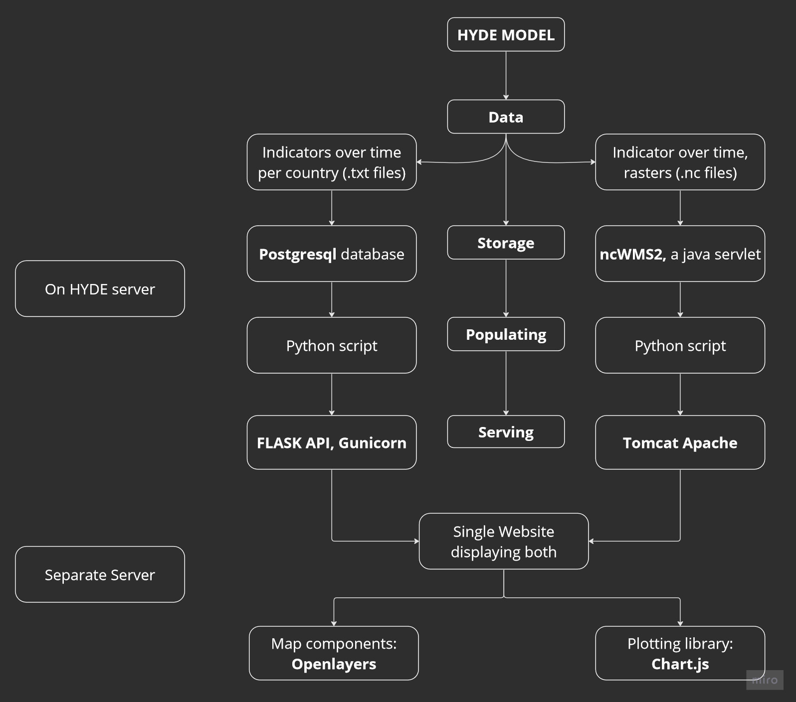

# Documentation
One of the goals of this project was to document how such a project should be handled. To this end, extensive documentation is provided which show the process of the creation of this application.  
In this the process of defining the application is described.

## What is the goal?
When starting such a comprehensive project, it is important to know what the end goal is, and which components are necessary for ths final goal. Through discussions with the supervisor, the final product has been described as having the following components:
A **website** needs to be hosted on a **server**, on this website a **world map** is displayed. This worldmap should have the ability to **display data**, in 2 ways: 
After clicking on one or multiple **countries**, something should pop up or be clickable to obtain data on certain **indicators** over a selected **time period**, in the form of **graphs** and with the ability to **extract the data** in multiple forms.
Secondly, information of an indicator within a certain year can be **overlayed** on the globe as a raster, also with the possibility to **extract** this data.

## Which components are necessary?
The following image summarizes all components of the final Hyde Portal and their relations.

Here, the two different datatypes that are visualised each have their own chain through which they are displayed, and how they combine into a single website is also shown. 

## Text files
On the left, the path to expose the .txt files from the HYDE model is explained. Each indicator has one text file, which contains information for each country and year that was modelled. The data from this .txt files will be stored in a postgres database, which has the following structure:  
For any indicator, there is one table as follows:
| | bce_10000 | bce_9000 | ... | ce_2017 |
| --- | --- | --- | --- | --- |
| country_1 | 
| country_2 | 
| ... |
| country_n |

This database will be populating by running a python script. This python scripts will read the txt files, connect to the database and insert the desired tables.  
Finally, a FLASK API runs, which is connected to the database. Requests can be made to this API to extract data out of the database. A request is done by connecting to a relevant URL, for example: http://localhost:8000/test or http://localhost:8000/uopp/4/bce_1000/ce_700. This API is exposed via gunicorn, this allows multiple users to access the API at the same time.

## Netcdf Files
On the left, the path to expose the .nc files from the HYDE model is explained. Each indicator has one netcdf file, which contains raster for the value of that indicator with a pixel size of **... x ...** for each modelled year. After some searching and considering other ways of serving (most notably, geoserver was carefully investigated and considered), ncWMS2 was selected as the most promosing tool for publishing netcdf data. ncWMS was chosen over geoserver since ncWMS is specifically developed for serving netCDF files, whilst geoserver has an extension which allows the same, but documentation for this extension was not found to be easy and a little outdated.ncWMS does exactly what is in it's name, it serves nc data in a WMS compliant way. ncWMS is populated using a python scripts, which uses the API of ncWMS to load the local .nc files into ncWMS. ncWMS is a java servlet (java web application) which we have setup to run in Apache Tomcat.

## Combined Website
The final website must show a map with multiple different aspects such as selectability and raster overlay. A suitable library for this is Openlayers. For the plotting of the timeseries, Chart.js was selected. 
