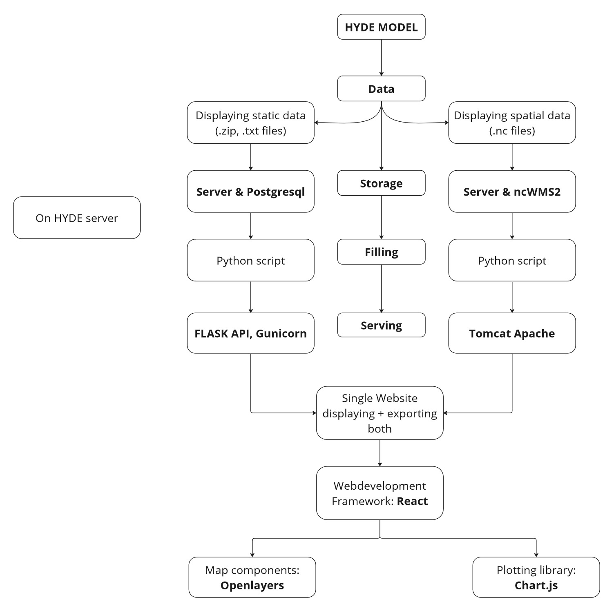

# Hyde Platform
This repository contains the code that was used to create the Hyde Platform, a platform which displays the data from the HYDE model (History Database of the Global Environment).  
This markdown has the following sections:
1) [Setup](#1-use): here a user can learn how to run this application easily on any system, how to make changes and restart the application.
2) [Structure](#2-structure): The subcomponents of the application are explained.
3) [Stack](#3-stack): contains an overview the tools, languages and libaries used to create this application.
4) [Development process](#4-development-process): contains an overview of thoughts behind how this application was developed.

## 1) Use
### Setup
1) Clone git repository
2) Install docker and docker compose (zet verwijzingen hier)
3) Optionally, obtain data from [YODA](https://landuse.sites.uu.nl/datasets/)
4) Supply HTTPS certificates to ./frontend/certificates
5) Write .env file as indicated in .env-template file
6) Execute `docker-compose up -d` from application directory
7) Optionally, to make the website available outside your own network: 
- sudo firewall-cmd --zone=dmz --add-service=http --permanent
- sudo firewall-cmd --zone=dmz --add-service=https --permanent
- sudo firewall-cmd --reload
The website and backend components can now be tested and accessed as follows:
#### timeseries-api
- Test FLASK locally: `curl 127.0.0.1:8000/test` should give "FLASK API setup correct!"
- Test Database locally: `curl 127.0.0.1:8000/api/txt/uopp/4/ce_600/ce_700` should give "[[6.344291354067953e-06, 1.846188784028077e-05]]" 
#### ncWMS
- Get password from .env file
- Test Server setup: `curl -H "Accept: text/plain" -u ncwms:trompetboom -X GET localhost:8080/ncWMS/admin/datasetStatus?dataset=0` SHould give: "Dataset: 0 not found on this server" 
- Test Data setup: `curl -H "Accept: text/plain" -u ncwms:[password] -X GET localhost:8080/ncWMS/admin/datasetStatus?dataset=irrigated_rice` Should give: "Dataset 16: (....): READY"
#### raster-api
- Test png retrieval: `curl http://localhost:8100/api/raster/png/pasture/ce_0` 
- Test ascii retrieval: `curl http://localhost:8100/api/raster/asc/popc/bce_10000`

### Restart
- from application root: `docker-compose down`, `docker system prune -f`, `docker-compose up -d`

### Change data locations
- change data locations within .env file.
- restart as above

### Change Website
1) Change content:
    - Website is stored in ./frontend/src. If you open this directory in a code editor, search within all subfile the existing text you want to change, and insert the new text. 
    - To change final year, change the value in .env
    - To change homepage content:
        - To change the Left (blue) part: change Jubmotron within ./frontend/src/Home.js 
        - To change the Right (Era Text): change the periodText from ./frontend/src/util/timelineObjects.js
    - To add remove indicators:
        - change indicatorTxtObj & indicatorNcObj within ./frontend/src/util/createData.js. Add indicator file name and the pretty name for on the website to both of the objects. 
        - place the data files for the new indicators within the same directory as where the old indicators are.
2) Execute `npm run build` from ./frontend, if npm not available, execute `sudo dnf install nodejs` first.
3) Execute `docker-compose down` from ./
4) remove the image from the component that was changed:
    - `docker system prune`
    - `docker rmi $(docker image list -aq)`
4) `docker-compose up -d`

## 2) Structure
This project is split into two components:
1) In the **frontend** folder, everything relating to the website can be found
2) In the **backend** folder, APIs can be found that are used to serve data to the website, more specifically we have
    - **ncWMS**: An already existing java servlet used to serve netCDF files in a WMS compliant way. This allows netCDF to be displayed in the webpage
    - **raster-api**: Creates an API to serve png's and ascii Grid files (rasters) for downloading, from the HYDE model.
    - **timeseries-api**: Creates an API to serve and download the txt files (timeseries per country) from the HYDE project.

## 3) Stack
For each of the components, different languages are used. 

### Overarching
- **git** was used to aid in version control. the git repository can be accessed through [github](https://github.com/UtrechtUniversity/Hyde-Platform).
- **Docker** was used to compartmentalize different parts of the application, and to allow for easy setup on different systems. 

### Backend
-  **ncWMS** is an existing java application that was used for serving netCDF files, read their [docs](https://github.com/Reading-eScience-Centre/ncwms/tree/master/docs) for more information.
- **postgres** is a database system where the information for the timeseries-api is stored.
- **python** was used to fill postgres and ncWMS.
- **Flask** is a python library used to create APIs , which were used to serve data.
- **Gunicorn** used by the Flask APIs, as WSGI HTTP server for managing requests.

### Frontend
- **HTML, CSS & JS**
- **React**, a javascript library aiding in web development
- **Openlayers**, a javascript library utilized for interactive maps on a webpage
- **Chart.js**, javascript library for displaying figures

## 4) Development Process
One of the goals of this project was to document how such a project should be handled. To this end, extensive documentation is provided which showing the though process behind creation of this application.  

### The desired product
When starting such a comprehensive project, it is important to know what the end goal is, and which components are necessary for ths final goal. Through discussions with the supervisor, the final product has been described as having the following components: \
A **website** needs to be hosted on a **server**, on this website a **world map** is displayed. This worldmap should have the ability to **display data**, in 2 ways: \
After clicking on one or multiple **countries**, something should pop up or be clickable to obtain data on certain **indicators** over a selected **time period**, in the form of **graphs** and with the ability to **extract the data** in multiple forms. \
Secondly, information of an indicator within a certain year can be **overlayed** on the globe as a raster, also with the possibility to **extract** this data.

### Mind map of components
The following image summarizes all components of the final Hyde Portal.

**From here on! Improve**

Here, the different types of data that are visualised each have their own chain through which they are displayed, and how they are combined into a single website is also shown. 

## Text files
On the left, the path to expose the .txt files from the HYDE model is explained. Each indicator has one text file, which contains information for each country and year that was modelled. The data from this .txt files will be stored in a postgres database, which has the following structure: \
For any indicator, there is one table which looks as follows
| | bce_10000 | bce_9000 | ... | ce_2017 |
| --- | --- | --- | --- | --- |
| country_1 | 
| country_2 | 
| ... |
| country_n |

In this way, for each indicator information for all countries and all years will be stored in a concise way.

This database will be populating by running a python script. This python scripts will read the txt files, connect to the database and insert the desired tables.  
Finally, a FLASK API runs, which is connected to the database. Requests can be made to this API to extract data out of the database. A request is done by connecting to a relevant URL, for example: http://localhost:8000/test or http://localhost:8000/uopp/4/bce_1000/ce_700. This API is exposed via gunicorn, this allows multiple users to access the API at the same time.

## Netcdf Files
On the right, the path to expose the .nc files from the HYDE model is explained. Each indicator has one netcdf file, which contains raster for the value of that indicator at a resolution of 5 arc minutes for each modelled year. After some searching and considering other ways of serving (most notably, geoserver was carefully investigated and considered), ncWMS2 was selected as the most promosing tool for publishing netcdf data. ncWMS serves nc data in a WMS compliant way. ncWMS is populated using a python scripts, which uses the API of ncWMS to load the local .nc files into ncWMS. ncWMS is a java servlet (java web application) which we have setup to run in Apache Tomcat.

## Combined Website
The final website must show a map with multiple different aspects such as selectability and raster overlay. A suitable library for this is Openlayers. For the plotting of the timeseries, Chart.js was selected. Finally, React was chosen as an overall framework to aid in the development flow.